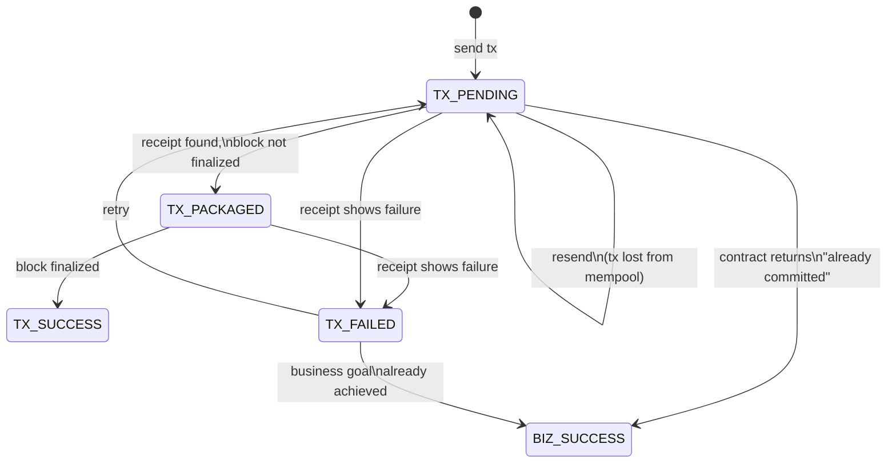
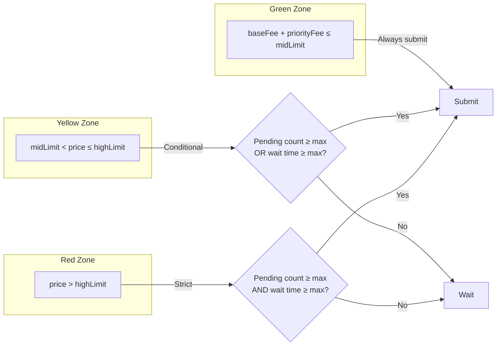

# Reliable Transaction Service

> [中文文档](reliable-transaction_CN.md)

## Overview

The Reliable Transaction Service is a core subsystem of L2-Relayer that ensures every L1/L2 transaction is eventually confirmed on-chain. It handles the full lifecycle of a transaction — from initial submission, through pending and packaged states, to final confirmation — with automatic **speed-up**, **resend**, and **retry** mechanisms.

---

## Transaction Flow

### Dual-Queue Architecture

Relayer maintains two separate submission queues, each backed by a different signing key:

| Queue | Signing Key | Transaction Type | Protocol |
|-------|-------------|-----------------|----------|
| **Batch Queue** | Blob Key | Batch commit (chunk data) | EIP-4844 (Blob Transaction) |
| **Proof Queue** | Legacy Key | Proof commit (TEE/ZK verification) | EIP-1559 |

- **Batch Queue**: Batches (#m … #n) are dequeued and submitted via EIP-4844 blob transactions using the Blob Key. The chunk data is encoded into blobs attached to the transaction.
- **Proof Queue**: Proofs (#m … #n) are dequeued and submitted via standard EIP-1559 transactions using the Legacy Key.

### Submission Process

1. A Batch or Proof is dequeued from its respective queue
2. Gas price is calculated based on the current network conditions (see [Gas Price Calculation](#gas-price-calculation))
3. The economic strategy is evaluated to decide whether to submit now (see [Economic Strategy](#economic-strategy-择时提交))
4. The transaction is signed with the appropriate key and sent to the network
5. A `ReliableTransaction` record is created with state `TX_PENDING`
6. The Reliable Tx Service begins monitoring the transaction

---

## Transaction State Machine

Each transaction goes through the following states:

### States

| State | Description |
|-------|-------------|
| `TX_PENDING` | Transaction sent to the mempool, waiting to be included in a block |
| `TX_PACKAGED` | Transaction included in a block, waiting for the block to be finalized |
| `TX_SUCCESS` | Transaction confirmed and block finalized |
| `TX_FAILED` | Transaction failed on-chain (reverted) |
| `BIZ_SUCCESS` | Transaction failed on-chain, but the business goal was already achieved (e.g., the Batch was already committed by another node) |

Both `TX_SUCCESS` and `BIZ_SUCCESS` are considered successful outcomes.

---

## Reliable Tx Service Logic

The Reliable Tx Service periodically scans for unfinalized transactions and applies the following rules:

| # | Condition | Action |
|---|-----------|--------|
| 1 | Transaction lost (not found on-chain) | **Resend** the transaction |
| 2 | Transaction packaged (in a block) | **Mark** as `TX_PACKAGED` |
| 3 | Transaction pending too long | **Speed up** by replacing with higher gas price |
| 4 | Transaction failed | **Mark** as `TX_FAILED` and **retry** |
| 5 | Transaction finalized | **Mark** as `TX_SUCCESS` |

### Speed-Up Mechanism

When a transaction remains in `TX_PENDING` state beyond the configured timeout (`tx-timeout-limit`, default 600 seconds), the service attempts to speed it up by sending a replacement transaction with the same nonce but higher gas prices.

**Speed-up rules:**

| Transaction Type | Gas Price Bump | Minimum Increase |
|-----------------|---------------|-----------------|
| EIP-1559 | `txSpeedupPriceBump` | 10% (1.1x) for both `maxFeePerGas` and `maxPriorityFeePerGas` |
| EIP-4844 | `txSpeedUpBlobFeeBump` | 100% (2x) for `maxFeePerBlobGas`; 10% for `maxFeePerGas`/`maxPriorityFeePerGas` |

**Speed-up limits:**
- `txSpeedUpPriorityFeeLimit`: Maximum priority fee allowed during speed-up (default: 100 Gwei)
- `txSpeedUpBlobFeeLimit`: Maximum blob fee allowed during speed-up (default: 1000 Gwei)

**Force speed-up**: If a transaction has been pending longer than `forceTxSpeedUpTimeLimit` (default: 15 minutes), the speed-up is forced even if gas conditions are not ideal.

### Resend Mechanism

If a transaction cannot be found on-chain (lost from the mempool), the service waits for `parentChainTxMissedTolerantTimeSec` (default: 5 seconds) and then resends the transaction. In `FAST` nonce mode, if the nonce has already been consumed (another transaction confirmed with the same nonce), the transaction is marked as `BIZ_SUCCESS`.

### Retry Mechanism

Failed transactions (`TX_FAILED`) can be automatically retried up to `retryCountLimit` times. Before retrying:
- For proof commits: the previous batch must be committed, and the previous proof transaction must be packaged or successful
- For batch commits: the previous batch commit must be packaged or successful

If the contract returns a "no need to retry" response (e.g., the batch was already committed), the transaction is marked as `BIZ_SUCCESS` instead of being retried.

---

## Gas Price Calculation

### EIP-4844 (Blob Transactions)

Used for Batch commits:

| Component | Formula |
|-----------|---------|
| `maxPriorityFeePerGas` | `eth_maxPriorityFeePerGas() × (1 + priorityFeeIncreasedPercentage)` (with minimum floor) |
| `maxFeePerGas` | `baseFee × baseFeeMultiplier + maxPriorityFeePerGas` |
| `maxFeePerBlobGas` | `blobBaseFee × blobFeeMultiplier` |

**Blob fee multiplier** uses a two-tier strategy:
- If `blobBaseFee > feePerBlobGasDividingVal` (default: 0.01 Gwei): multiplier = `largerFeePerBlobGasMultiplier` (default: 2)
- If `blobBaseFee ≤ feePerBlobGasDividingVal`: multiplier = `smallerFeePerBlobGasMultiplier` (default: 1000)

This ensures that when blob fees are very low, enough margin is provided to handle sudden spikes.

### EIP-1559 (Regular Transactions)

Used for Proof commits and L1 message relay:

| Component | Formula |
|-----------|---------|
| `maxPriorityFeePerGas` | `eth_maxPriorityFeePerGas() × (1 + priorityFeeIncreasedPercentage)` (with minimum floor) |
| `maxFeePerGas` | `baseFee × baseFeeMultiplier + maxPriorityFeePerGas` |

### Default Parameters

| Parameter | Default | Description |
|-----------|---------|-------------|
| `baseFeeMultiplier` | 2 | Multiplier for base fee |
| `priorityFeePerGasIncreasedPercentage` | 0.5 | Priority fee increase (50%) |
| `eip4844PriorityFeePerGasIncreasedPercentage` | 1.0 | EIP-4844 priority fee increase (100%) |
| `minimumEip1559PriorityPrice` | configurable | Minimum priority fee floor |
| `minimumEip4844PriorityPrice` | configurable | Minimum EIP-4844 priority fee floor |

---

## Economic Strategy (择时提交)

The economic strategy controls **when** transactions should be submitted based on current L1 gas prices. Gas prices are classified into three zones:

### Zone Definitions

| Zone | Condition | Submission Policy |
|------|-----------|-------------------|
| **Green** | `currentPrice ≤ midEip1559PriceLimit` | Submit immediately |
| **Yellow** | `midLimit < currentPrice ≤ highEip1559PriceLimit` | Submit if pending count ≥ threshold **OR** wait time ≥ threshold |
| **Red** | `currentPrice > highEip1559PriceLimit` | Submit only if pending count ≥ threshold **AND** wait time ≥ threshold |

Where `currentPrice = baseFee + maxPriorityFeePerGas`.

### Default Thresholds

| Parameter | Default | Description |
|-----------|---------|-------------|
| `midEip1559PriceLimit` | 3 Gwei | Green/Yellow boundary |
| `highEip1559PriceLimit` | 8 Gwei | Yellow/Red boundary |
| `maxPendingBatchCount` | 12 | Max tolerable pending Batches |
| `maxPendingProofCount` | 12 | Max tolerable pending Proofs |
| `maxBatchWaitingTime` | 43200 s (12 h) | Max Batch wait before forced submit |
| `maxProofWaitingTime` | 43200 s (12 h) | Max Proof wait before forced submit |

### Cost Checkers

The economic strategy is enforced by four cost checkers, each applying the zone logic to a different operation:

| Cost Checker | Applies To |
|-------------|------------|
| `BatchCommitCostChecker` | Batch commit transactions |
| `ProofCommitCostChecker` | Proof commit transactions |
| `SpeedUpTxCostChecker` | Transaction speed-ups (Green + Yellow allowed; Red requires thresholds) |
| `RetryTxCostChecker` | Transaction retries (Green + Yellow allowed; Red requires thresholds) |

All thresholds are **dynamically configurable** at runtime via the [Admin CLI](../admin-cli/README.md).

---

## Nonce Management

Relayer supports two nonce management modes:

| Mode | Description | Use Case |
|------|-------------|----------|
| **NORMAL** | Fetches nonce from the chain via `eth_getTransactionCount(PENDING)` for each transaction | Conservative, avoids nonce conflicts |
| **FAST** | Maintains a Redis-cached nonce counter, incremented locally after each send | High throughput, reduces RPC calls |

### FAST Mode Details

- Nonce is cached in Redis with a distributed lock
- After sending a transaction, the nonce is incremented locally
- On failure, the nonce cache can be reset to resync with on-chain state
- Admin can manually override the nonce via the [Admin CLI](../admin-cli/README.md) (`update-relayer-account-nonce-manually`)

### Configuration

| Parameter | Default | Description |
|-----------|---------|-------------|
| `l2-relayer.l1-client.nonce-policy` | NORMAL | L1 nonce management mode |
| `l2-relayer.subchain.l2-nonce-policy` | - | L2 nonce management mode |

---

## Transaction Types

| Type | Chain | Protocol | Description |
|------|-------|----------|-------------|
| `BATCH_COMMIT_TX` | L1 | EIP-4844 | Batch data commit with blobs |
| `BATCH_TEE_PROOF_COMMIT_TX` | L1 | EIP-1559 | TEE proof verification |
| `BATCH_ZK_PROOF_COMMIT_TX` | L1 | EIP-1559 | ZK proof verification |
| `L1_MSG_TX` | L2 | EIP-1559 | L1 message relay to L2 |
| `L2_ORACLE_BASE_FEE_FEED_TX` | L2 | EIP-1559 | Oracle base fee feed |
| `L2_ORACLE_BATCH_FEE_FEED_TX` | L2 | EIP-1559 | Oracle batch fee feed |

---

## Block Finalization

Transaction confirmation requires block finalization. The finalization policy is configurable:

| Chain | Config | Default | Description |
|-------|--------|---------|-------------|
| L1 | `l2-relayer.tasks.block-polling.l1.policy` | FINALIZED | Wait for Ethereum finalized block |
| L2 | `l2-relayer.tasks.block-polling.l2.policy` | LATEST | Use latest block |

A transaction is considered finalized when:
- A receipt exists for the transaction
- The receipt's block number ≤ the latest block number under the configured finalization policy
- The receipt's block number > 0

---

## Configuration Reference

### Reliable Tx Service

| Parameter | Default | Description |
|-----------|---------|-------------|
| `l2-relayer.tasks.reliable-tx.tx-timeout-limit` | 600 s | Time before a pending tx is sped up |
| `l2-relayer.tasks.reliable-tx.retry-limit` | 0 | Max retry count for failed txs (0 = disabled) |
| `l2-relayer.tasks.reliable-tx.process-batch-size` | 10 | Number of txs processed per cycle |

### Speed-Up

| Parameter | Default | Description |
|-----------|---------|-------------|
| `l2-relayer.l1-client.tx-speedup-price-bump` | 0.1 (10%) | EIP-1559 gas price bump ratio |
| `l2-relayer.l1-client.tx-speedup-blob-price-bump` | 1.0 (100%) | EIP-4844 blob gas price bump ratio |
| `l2-relayer.l1-client.tx-speedup-priority-fee-limit` | 100 Gwei | Max priority fee for speed-up |
| `l2-relayer.l1-client.tx-speedup-blob-fee-limit` | 1000 Gwei | Max blob fee for speed-up |
| `l2-relayer.l1-client.force-tx-speedup-time-limit` | 900000 ms (15 min) | Force speed-up after this duration |

### Economic Strategy

| Parameter | Default | Description |
|-----------|---------|-------------|
| `l2-relayer.rollup.economic-strategy-conf.switch` | true | Enable/disable economic strategy |
| `default-mid-eip1559-price-limit` | 3 Gwei | Green/Yellow boundary |
| `default-high-eip1559-price-limit` | 8 Gwei | Yellow/Red boundary |
| `default-max-pending-batch-count` | 12 | Pending batch threshold |
| `default-max-pending-proof-count` | 12 | Pending proof threshold |
| `default-max-batch-waiting-time` | 43200 s | Max batch wait time |
| `default-max-proof-waiting-time` | 43200 s | Max proof wait time |

---

## Source File Reference

| Category | File Path |
|----------|-----------|
| Reliable Tx service | `relayer-app/.../service/ReliableTxServiceImpl.java` |
| Reliable Tx interface | `relayer-app/.../service/IReliableTxService.java` |
| Transaction state enum | `relayer-commons/.../enums/ReliableTransactionStateEnum.java` |
| Transaction type enum | `relayer-commons/.../enums/TransactionTypeEnum.java` |
| Transaction model | `relayer-commons/.../models/ReliableTransactionDO.java` |
| L1 Client | `relayer-app/.../blockchain/L1Client.java` |
| Gas price provider | `relayer-app/.../blockchain/helper/EthereumGasPriceProvider.java` |
| API gas price provider | `relayer-app/.../blockchain/helper/ApiGasPriceProvider.java` |
| Economic strategy | `relayer-app/.../layer2/economic/RollupEconomicStrategy.java` |
| Economic strategy config | `relayer-app/.../layer2/economic/RollupEconomicStrategyConfig.java` |
| Batch commit cost checker | `relayer-app/.../layer2/economic/BatchCommitCostChecker.java` |
| Proof commit cost checker | `relayer-app/.../layer2/economic/ProofCommitCostChecker.java` |
| Nonce manager (FAST) | `relayer-app/.../blockchain/helper/CachedNonceManager.java` |
| Nonce manager (NORMAL) | `relayer-app/.../blockchain/helper/RemoteNonceManager.java` |
| Transaction manager | `relayer-app/.../blockchain/helper/BaseRawTransactionManager.java` |
