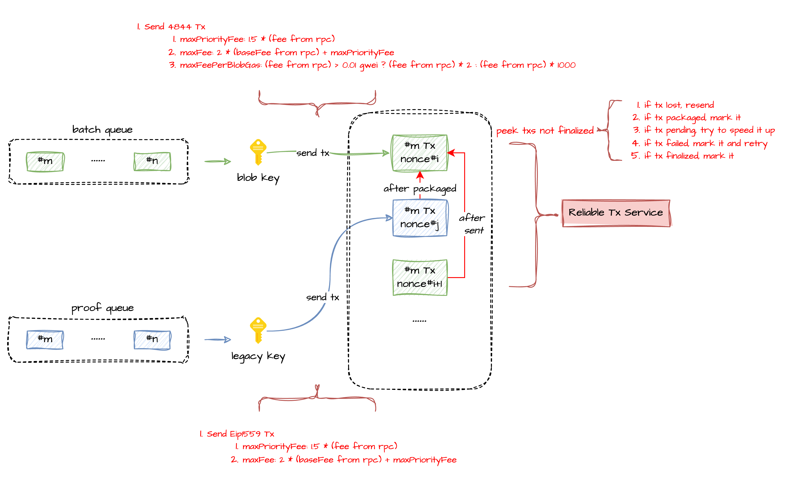
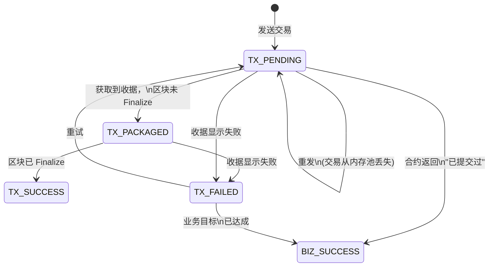
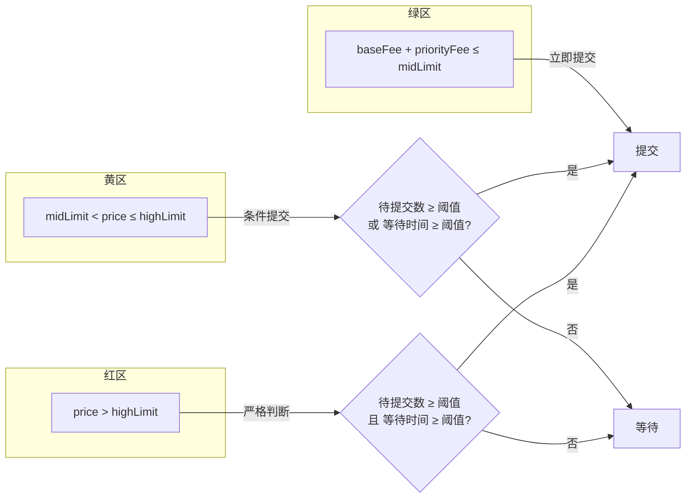

# 可靠上链服务

> [English Version](reliable-transaction.md)

## 概述

可靠上链服务（Reliable Transaction Service）是 L2-Relayer 的核心子系统，确保每笔 L1/L2 交易最终在链上确认。它管理交易的完整生命周期 — 从初始提交、经历 Pending 和 Packaged 状态、到最终确认 — 并提供自动**加速**、**重发**和**重试**机制。

---

## 交易流程

### 双队列架构

Relayer 维护两个独立的提交队列，每个队列使用不同的签名密钥：

| 队列 | 签名密钥 | 交易类型 | 协议 |
|------|----------|---------|------|
| **Batch 队列** | Blob Key | Batch 提交（Chunk 数据） | EIP-4844（Blob 交易） |
| **Proof 队列** | Legacy Key | Proof 提交（TEE/ZK 验证） | EIP-1559 |

- **Batch 队列**：Batch（#m … #n）从队列中取出，通过 Blob Key 使用 EIP-4844 Blob 交易提交。Chunk 数据被编码到交易附带的 Blob 中。
- **Proof 队列**：Proof（#m … #n）从队列中取出，通过 Legacy Key 使用标准 EIP-1559 交易提交。

### 提交流程

1. 从对应队列取出一个 Batch 或 Proof
2. 根据当前网络状况计算 Gas 价格（参见 [Gas 价格计算](#gas-价格计算)）
3. 评估经济策略，决定是否立即提交（参见 [经济策略](#经济策略择时提交)）
4. 使用对应的密钥签名并发送交易
5. 创建 `ReliableTransaction` 记录，状态设为 `TX_PENDING`
6. 可靠上链服务开始监控该交易

---

## 交易状态机

每笔交易经历以下状态：

### 状态说明

| 状态 | 说明 |
|------|------|
| `TX_PENDING` | 交易已发送到内存池，等待被打包到区块中 |
| `TX_PACKAGED` | 交易已被打包到区块中，等待区块 Finalize |
| `TX_SUCCESS` | 交易已确认，区块已 Finalize |
| `TX_FAILED` | 交易在链上执行失败（Revert） |
| `BIZ_SUCCESS` | 交易在链上失败，但业务目标已达成（例如，Batch 已被其他节点提交） |

`TX_SUCCESS` 和 `BIZ_SUCCESS` 都被视为成功结果。

---

## 可靠上链服务逻辑

可靠上链服务周期性扫描未最终确认的交易，并执行以下规则：

| # | 条件 | 动作 |
|---|------|------|
| 1 | 交易丢失（链上找不到） | **重发**交易 |
| 2 | 交易已打包（在区块中） | **标记**为 `TX_PACKAGED` |
| 3 | 交易 Pending 超时 | **加速**，用更高 Gas 价格的替换交易 |
| 4 | 交易失败 | **标记**为 `TX_FAILED` 并**重试** |
| 5 | 交易已 Finalize | **标记**为 `TX_SUCCESS` |

### 加速机制（Speed-Up）

当交易处于 `TX_PENDING` 状态超过配置的超时时间（`tx-timeout-limit`，默认 600 秒），服务会尝试加速：发送一笔具有相同 Nonce 但更高 Gas 价格的替换交易。

**加速规则：**

| 交易类型 | Gas 价格提升 | 最低涨幅要求 |
|---------|------------|------------|
| EIP-1559 | `txSpeedupPriceBump` | `maxFeePerGas` 和 `maxPriorityFeePerGas` 各至少涨 10%（1.1 倍） |
| EIP-4844 | `txSpeedUpBlobFeeBump` | `maxFeePerBlobGas` 至少涨 100%（2 倍）；`maxFeePerGas`/`maxPriorityFeePerGas` 至少涨 10% |

**加速上限：**
- `txSpeedUpPriorityFeeLimit`：加速时允许的最大 Priority Fee（默认：100 Gwei）
- `txSpeedUpBlobFeeLimit`：加速时允许的最大 Blob Fee（默认：1000 Gwei）

**强制加速**：如果交易 Pending 超过 `forceTxSpeedUpTimeLimit`（默认：15 分钟），即使 Gas 条件不理想也会强制加速。

### 重发机制（Resend）

如果交易在链上找不到（从内存池丢失），服务会等待 `parentChainTxMissedTolerantTimeSec`（默认：5 秒）后重发交易。在 `FAST` Nonce 模式下，如果 Nonce 已被消耗（另一笔交易以相同 Nonce 确认），则将该交易标记为 `BIZ_SUCCESS`。

### 重试机制（Retry）

失败的交易（`TX_FAILED`）可以自动重试，最多 `retryCountLimit` 次。重试前的前置检查：
- Proof 提交：前一个 Batch 必须已提交，前一笔 Proof 交易必须已打包或成功
- Batch 提交：前一个 Batch 提交交易必须已打包或成功

如果合约返回"无需重试"的响应（例如 Batch 已被提交），交易会被标记为 `BIZ_SUCCESS` 而非继续重试。

---

## Gas 价格计算

### EIP-4844（Blob 交易）

用于 Batch 提交：

| 组成部分 | 计算公式 |
|---------|---------|
| `maxPriorityFeePerGas` | `eth_maxPriorityFeePerGas() × (1 + priorityFeeIncreasedPercentage)`（有最低下限） |
| `maxFeePerGas` | `baseFee × baseFeeMultiplier + maxPriorityFeePerGas` |
| `maxFeePerBlobGas` | `blobBaseFee × blobFeeMultiplier` |

**Blob Fee 倍数**采用两级策略：
- 若 `blobBaseFee > feePerBlobGasDividingVal`（默认：0.01 Gwei）：倍数 = `largerFeePerBlobGasMultiplier`（默认：2）
- 若 `blobBaseFee ≤ feePerBlobGasDividingVal`：倍数 = `smallerFeePerBlobGasMultiplier`（默认：1000）

当 Blob Fee 极低时，使用更大的倍数可以提供足够的余量来应对突然的价格飙升。

### EIP-1559（普通交易）

用于 Proof 提交和 L1 消息中继：

| 组成部分 | 计算公式 |
|---------|---------|
| `maxPriorityFeePerGas` | `eth_maxPriorityFeePerGas() × (1 + priorityFeeIncreasedPercentage)`（有最低下限） |
| `maxFeePerGas` | `baseFee × baseFeeMultiplier + maxPriorityFeePerGas` |

### 默认参数

| 参数 | 默认值 | 说明 |
|------|--------|------|
| `baseFeeMultiplier` | 2 | Base Fee 倍数 |
| `priorityFeePerGasIncreasedPercentage` | 0.5 | Priority Fee 增幅（50%） |
| `eip4844PriorityFeePerGasIncreasedPercentage` | 1.0 | EIP-4844 Priority Fee 增幅（100%） |
| `minimumEip1559PriorityPrice` | 可配置 | 最低 Priority Fee 下限 |
| `minimumEip4844PriorityPrice` | 可配置 | 最低 EIP-4844 Priority Fee 下限 |

---

## 经济策略（择时提交）

经济策略控制**何时**提交交易，基于当前 L1 Gas 价格。Gas 价格被划分为三个区间：

### 区间定义

| 区间 | 条件 | 提交策略 |
|------|------|---------|
| **绿区** | `currentPrice ≤ midEip1559PriceLimit` | 立即提交 |
| **黄区** | `midLimit < currentPrice ≤ highEip1559PriceLimit` | 待提交数 ≥ 阈值 **或** 等待时间 ≥ 阈值时提交 |
| **红区** | `currentPrice > highEip1559PriceLimit` | 仅当待提交数 ≥ 阈值 **且** 等待时间 ≥ 阈值时提交 |

其中 `currentPrice = baseFee + maxPriorityFeePerGas`。

### 默认阈值

| 参数 | 默认值 | 说明 |
|------|--------|------|
| `midEip1559PriceLimit` | 3 Gwei | 绿区/黄区分界线 |
| `highEip1559PriceLimit` | 8 Gwei | 黄区/红区分界线 |
| `maxPendingBatchCount` | 12 | 最大容忍待提交 Batch 数 |
| `maxPendingProofCount` | 12 | 最大容忍待提交 Proof 数 |
| `maxBatchWaitingTime` | 43200 秒（12 小时） | Batch 最长等待时间，超时强制提交 |
| `maxProofWaitingTime` | 43200 秒（12 小时） | Proof 最长等待时间，超时强制提交 |

### 成本检查器

经济策略通过四个成本检查器执行，每个检查器将区间逻辑应用于不同的操作：

| 成本检查器 | 应用场景 |
|-----------|---------|
| `BatchCommitCostChecker` | Batch 提交交易 |
| `ProofCommitCostChecker` | Proof 提交交易 |
| `SpeedUpTxCostChecker` | 交易加速（绿区 + 黄区允许；红区需满足阈值） |
| `RetryTxCostChecker` | 交易重试（绿区 + 黄区允许；红区需满足阈值） |

所有阈值均可通过 [Admin CLI](../admin-cli/README_CN.md) 在运行时**动态配置**。

---

## Nonce 管理

Relayer 支持两种 Nonce 管理模式：

| 模式 | 说明 | 使用场景 |
|------|------|---------|
| **NORMAL** | 每次通过 `eth_getTransactionCount(PENDING)` 从链上获取 Nonce | 保守模式，避免 Nonce 冲突 |
| **FAST** | 维护 Redis 缓存的 Nonce 计数器，每次发送后本地递增 | 高吞吐模式，减少 RPC 调用 |

### FAST 模式详情

- Nonce 通过分布式锁缓存在 Redis 中
- 发送交易后，Nonce 在本地递增
- 失败时可重置 Nonce 缓存以与链上状态重新同步
- 管理员可通过 [Admin CLI](../admin-cli/README_CN.md) 手动覆盖 Nonce（`update-relayer-account-nonce-manually`）

### 配置

| 参数 | 默认值 | 说明 |
|------|--------|------|
| `l2-relayer.l1-client.nonce-policy` | NORMAL | L1 Nonce 管理模式 |
| `l2-relayer.subchain.l2-nonce-policy` | - | L2 Nonce 管理模式 |

---

## 交易类型

| 类型 | 链 | 协议 | 说明 |
|------|-----|------|------|
| `BATCH_COMMIT_TX` | L1 | EIP-4844 | 带 Blob 的 Batch 数据提交 |
| `BATCH_TEE_PROOF_COMMIT_TX` | L1 | EIP-1559 | TEE 证明验证 |
| `BATCH_ZK_PROOF_COMMIT_TX` | L1 | EIP-1559 | ZK 证明验证 |
| `L1_MSG_TX` | L2 | EIP-1559 | L1 消息中继到 L2 |
| `L2_ORACLE_BASE_FEE_FEED_TX` | L2 | EIP-1559 | Oracle Base Fee 喂价 |
| `L2_ORACLE_BATCH_FEE_FEED_TX` | L2 | EIP-1559 | Oracle Batch Fee 喂价 |

---

## 区块 Finalize

交易确认依赖区块 Finalize。Finalize 策略可配置：

| 链 | 配置项 | 默认值 | 说明 |
|-----|--------|--------|------|
| L1 | `l2-relayer.tasks.block-polling.l1.policy` | FINALIZED | 等待以太坊 Finalized 区块 |
| L2 | `l2-relayer.tasks.block-polling.l2.policy` | LATEST | 使用最新区块 |

交易被视为已 Finalize 的条件：
- 交易收据存在
- 收据的区块高度 ≤ 配置的 Finalize 策略下的最新区块高度
- 收据的区块高度 > 0

---

## 配置参考

### 可靠上链服务

| 参数 | 默认值 | 说明 |
|------|--------|------|
| `l2-relayer.tasks.reliable-tx.tx-timeout-limit` | 600 秒 | Pending 交易超时后触发加速 |
| `l2-relayer.tasks.reliable-tx.retry-limit` | 0 | 失败交易最大重试次数（0 = 禁用） |
| `l2-relayer.tasks.reliable-tx.process-batch-size` | 10 | 每轮处理的交易数量 |

### 加速配置

| 参数 | 默认值 | 说明 |
|------|--------|------|
| `l2-relayer.l1-client.tx-speedup-price-bump` | 0.1（10%） | EIP-1559 Gas 价格加速比例 |
| `l2-relayer.l1-client.tx-speedup-blob-price-bump` | 1.0（100%） | EIP-4844 Blob Gas 价格加速比例 |
| `l2-relayer.l1-client.tx-speedup-priority-fee-limit` | 100 Gwei | 加速时最大 Priority Fee |
| `l2-relayer.l1-client.tx-speedup-blob-fee-limit` | 1000 Gwei | 加速时最大 Blob Fee |
| `l2-relayer.l1-client.force-tx-speedup-time-limit` | 900000 毫秒（15 分钟） | 超过此时间强制加速 |

### 经济策略

| 参数 | 默认值 | 说明 |
|------|--------|------|
| `l2-relayer.rollup.economic-strategy-conf.switch` | true | 启用/禁用经济策略 |
| `default-mid-eip1559-price-limit` | 3 Gwei | 绿区/黄区分界线 |
| `default-high-eip1559-price-limit` | 8 Gwei | 黄区/红区分界线 |
| `default-max-pending-batch-count` | 12 | 待提交 Batch 数阈值 |
| `default-max-pending-proof-count` | 12 | 待提交 Proof 数阈值 |
| `default-max-batch-waiting-time` | 43200 秒 | Batch 最长等待时间 |
| `default-max-proof-waiting-time` | 43200 秒 | Proof 最长等待时间 |

---

## 源代码文件参考

| 分类 | 文件路径 |
|------|----------|
| 可靠上链服务实现 | `relayer-app/.../service/ReliableTxServiceImpl.java` |
| 可靠上链服务接口 | `relayer-app/.../service/IReliableTxService.java` |
| 交易状态枚举 | `relayer-commons/.../enums/ReliableTransactionStateEnum.java` |
| 交易类型枚举 | `relayer-commons/.../enums/TransactionTypeEnum.java` |
| 交易数据模型 | `relayer-commons/.../models/ReliableTransactionDO.java` |
| L1 客户端 | `relayer-app/.../blockchain/L1Client.java` |
| Gas 价格提供者 | `relayer-app/.../blockchain/helper/EthereumGasPriceProvider.java` |
| API Gas 价格提供者 | `relayer-app/.../blockchain/helper/ApiGasPriceProvider.java` |
| 经济策略 | `relayer-app/.../layer2/economic/RollupEconomicStrategy.java` |
| 经济策略配置 | `relayer-app/.../layer2/economic/RollupEconomicStrategyConfig.java` |
| Batch 提交成本检查 | `relayer-app/.../layer2/economic/BatchCommitCostChecker.java` |
| Proof 提交成本检查 | `relayer-app/.../layer2/economic/ProofCommitCostChecker.java` |
| Nonce 管理（FAST） | `relayer-app/.../blockchain/helper/CachedNonceManager.java` |
| Nonce 管理（NORMAL） | `relayer-app/.../blockchain/helper/RemoteNonceManager.java` |
| 交易管理器 | `relayer-app/.../blockchain/helper/BaseRawTransactionManager.java` |
