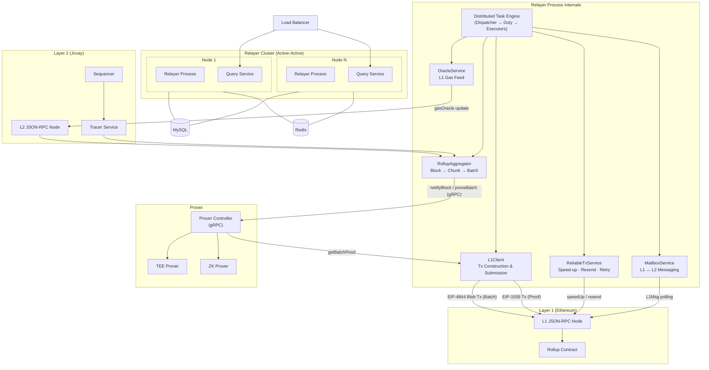
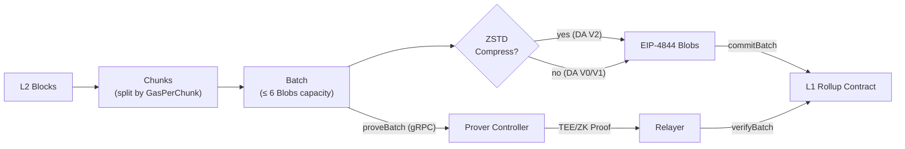
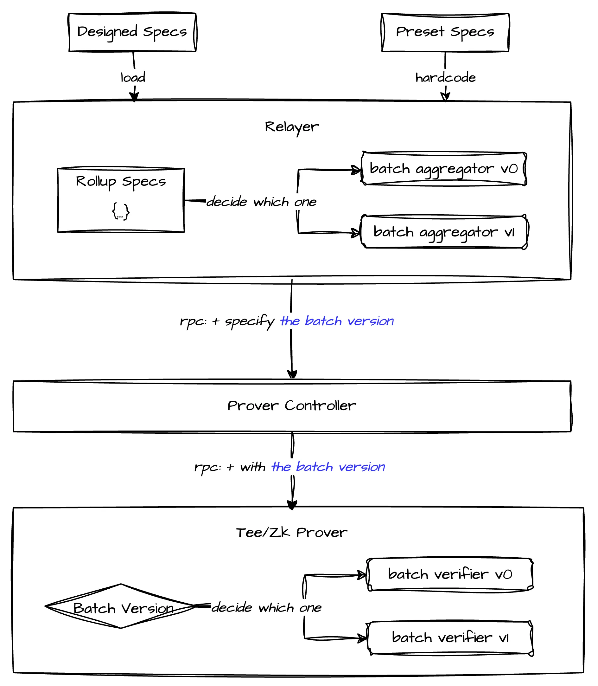
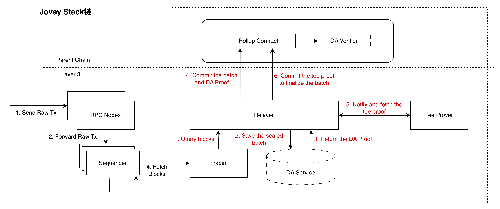
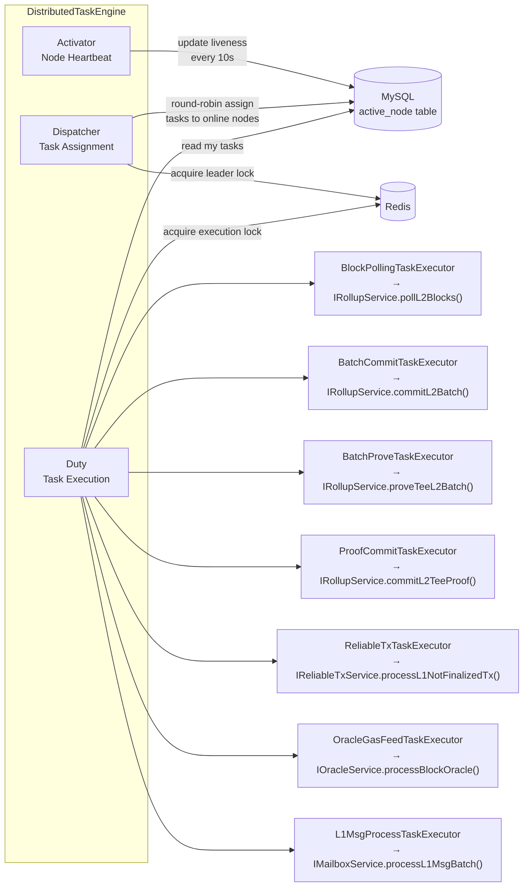

<div align="center">
  

  <h1>Jovay Relayer</h1>

  <p><strong>The core middleware for Jovay L2 Rollup — reliable data aggregation, submission, and proof management between L1 and L2.</strong></p>

  <p>
    <a href="https://www.java.com">
      
    </a>
    <a href="#">
      
    </a>
    <a href="#">
      
    </a>
  </p>

  <p>
    <a href="#architecture">Architecture</a> &bull;
    <a href="#features">Features</a> &bull;
    <a href="#project-structure">Project Structure</a> &bull;
    <a href="#getting-started">Getting Started</a> &bull;
    <a href="README_CN.md">中文文档</a>
  </p>
</div>

---

## Architecture

Relayer sits between Layer 1 (Ethereum) and Layer 2 (Jovay), driving the full Rollup lifecycle. It continuously polls L2 blocks, aggregates them into Chunks and Batches, submits Batches to the L1 Rollup contract via EIP-4844 Blob transactions, coordinates with the Prover Controller to obtain TEE/ZK proofs, and then commits those proofs on-chain through EIP-1559 transactions. A dedicated Reliable Transaction Service ensures every L1 transaction reaches finality — automatically speeding up, resending, or retrying as needed.

### System Overview

Relayer is deployed as a **multi-node active-active cluster** (typically 2 nodes), coordinated through shared MySQL and Redis. Each node runs two independent processes — the **Relayer** process (driving all Rollup tasks) and the **Query Service** process (providing REST APIs for external data queries). A load balancer distributes query traffic across Query Service instances.



### Rollup Data Pipeline

The core data flow transforms raw L2 blocks into finalized, proven Batches on L1:



---

## Features

### Rollup Core

Relayer continuously pulls blocks from the L2 Jovay chain via the Tracer Service. The `RollupAggregator` assembles blocks into **Chunks** based on a configurable gas target (`GasPerChunk`), then packs Chunks into **Batches** constrained by EIP-4844 Blob capacity (up to 6 Blobs per Batch). Once a Batch is sealed, Relayer constructs an EIP-4844 Blob transaction and submits it to the L1 Rollup contract. In parallel, Relayer notifies the Prover Controller to begin proof generation.

### Proof Management

Relayer supports both **TEE** (Trusted Execution Environment) and **ZK** (Zero-Knowledge) proofs. After submitting a Batch, Relayer periodically polls the Prover Controller via gRPC to check if a proof is ready. Once obtained, the proof is submitted to the L1 Rollup contract through a standard EIP-1559 transaction. Rollup Specs controls which Batch index starts requiring ZK verification.

### Reliable Transaction Service

Every L1 transaction (Batch commit or Proof commit) is tracked by the `ReliableTxService`, which ensures on-chain finality through three mechanisms:
- **Speed-up**: If a transaction remains unconfirmed beyond a configurable timeout, Relayer resubmits it at the same nonce with a higher gas tip (10%+ bump for EIP-1559, 100%+ for EIP-4844).
- **Resend**: If a transaction disappears from the mempool (RPC returns null and the finalized nonce hasn't advanced), the original signed transaction is re-broadcast.
- **Retry**: If a transaction's receipt shows failure (status = 0), Relayer performs an `eth_call` pre-check and, if conditions are met, sends a fresh transaction with a new nonce.

For a detailed description of the transaction state machine, gas price calculation, speed-up/resend/retry mechanisms, economic strategy, and nonce management, see the [Reliable Transaction Service Reference](.doc/reliable-transaction.md).

### Economic Timing Strategy

To optimize L1 gas costs, Relayer implements a **gas-price-aware submission strategy**. Gas prices are classified into three zones — Green, Yellow, and Red — each with different submission policies. In the Green zone, transactions are sent immediately. In the Yellow zone, submission proceeds only if pending count exceeds a threshold **or** wait time is too long. In the Red zone, **both** conditions must be met. This applies to Batch commits, Proof commits, and Reliable Tx operations.

### Batch Data Compression

Relayer uses **ZSTD** (level 3) to compress Batch data before packing it into Blobs. The compression decision is automatic: if ZSTD reduces the data size, compressed data is written with DA Version 2; otherwise, uncompressed data is written with DA Version 1. This can reduce L1 data costs by approximately 40%. For a detailed breakdown of the Batch and Chunk data structures, field layouts, version differences, and DA encoding formats, see the [Batch Data Structure Reference](.doc/batch-data-structure.md).

### Rollup Specs — Protocol Versioning

Rollup Specs provides a **fork-based protocol upgrade mechanism** inspired by Ethereum hard forks. Each "fork" defines a `BatchVersion` that takes effect at a specific Batch index, controlling how Batches are serialized, compressed, and proven. The specs are preset for mainnet and testnet, and fully customizable for private networks via external JSON configuration.

<p align="center">
  
</p>

### Cross-Chain Messaging (Mailbox)

Relayer supports **L1 → L2 messaging** (Deposits) and **L2 → L1 messaging** (Withdrawals) through the Mailbox mechanism. For deposits, a dedicated `L1MsgProcessTask` polls the L1 Mailbox contract for `MessageSent` events and records them for L2 processing. For withdrawals, Relayer computes a Merkle root of L2 messages and includes it in each Batch submission; the Query Service exposes an API for users to obtain Merkle proofs needed to finalize withdrawals on L1.

### L1 Gas Oracle

The `OracleService` periodically reads L1 gas prices and submits them to the L2 `L1GasOracle` contract, enabling L2 to accurately estimate L1-related costs for users.

### Multi-Active High Availability

Relayer's distributed task engine enables **active-active multi-node deployment**. Nodes maintain heartbeat records in MySQL. A leader (elected via Redis distributed lock) runs the `Dispatcher` to assign task time-slices across online nodes using round-robin. Each node's `Duty` component executes only its assigned tasks, with Redis locks preventing concurrent execution of the same task across nodes.

### Jovay Stack — L3 Support

Relayer can operate as part of the **Jovay Stack** for L3 chains. When the Parent Chain is another Jovay instance (rather than Ethereum), Relayer switches from EIP-4844 Blob submission to a **DA Service** model. In this mode, Relayer stores Batch data through a DA Service and submits a DA proof to the Parent Chain's Rollup contract via `commitBatchWithDaProof`.

<p align="center">
  
</p>

### Additional Capabilities

- **Alibaba Cloud KMS** integration for secure private key management, eliminating the need for plaintext keys in configuration.
- **Ethereum hard fork adaptation** (BPO1/BPO2/Fusaka) with configurable Blob sidecar versions and base fee calculation parameters per fork timestamp.
- **Dynamic configuration** — certain parameters (gas price multipliers, economic thresholds, speed-up timeouts) can be hot-reloaded via the [Admin CLI](admin-cli/README.md) without restarting the service.
- **Graceful shutdown** — on receiving SIGTERM, the Relayer finishes processing the current block before stopping, ensuring data consistency.

---

## Distributed Task Engine

All Relayer operations are driven by a distributed scheduling engine built on three core components:



The **Activator** periodically writes heartbeat records to MySQL's `active_node` table. The **Dispatcher** acquires a Redis distributed lock to become the cluster leader, queries active nodes, and assigns task time-slices using round-robin (keeping `BLOCK_POLLING_TASK` sticky to the same node when possible). The **Duty** component polls the task table for assignments belonging to the local node and dispatches them to the corresponding `BaseScheduleTaskExecutor` implementations, each backed by a dedicated thread pool.

---

## Project Structure

```
L2-Relayer/
├── relayer-commons/          # Shared models, enums, ABI wrappers, Rollup Specs, utilities
├── relayer-dal/              # Data access layer (MyBatis-Plus entities & mappers)
├── relayer-app/              # Core Relayer application
│   ├── config/               #   Configuration (RollupConfig, ParentChainConfig, DaServiceConfig)
│   ├── engine/               #   Distributed task scheduling engine
│   │   ├── core/             #     Dispatcher, Duty, ScheduleContext
│   │   ├── checker/          #     IDistributedTaskChecker implementations
│   │   └── executor/         #     Task executors (BlockPolling, BatchCommit, etc.)
│   ├── service/              #   Business services (Rollup, ReliableTx, Oracle, Mailbox)
│   ├── core/                 #   Domain logic
│   │   ├── layer2/           #     RollupAggregator, GrowingBatchChunksMemCache
│   │   ├── blockchain/       #     L1Client, NonceManager, TxManager
│   │   └── prover/           #     ProverControllerClient (gRPC)
│   ├── dal/repository/       #   Repository interfaces and implementations
│   └── metrics/              #   OpenTelemetry metrics
├── query-service/            # REST API for L2 msg proof & batch metadata queries
├── admin-cli/                # Spring Shell CLI for runtime admin operations (see [README](admin-cli/README.md))
├── jovay-sign-service-spring-boot-starter/  # Tx signing starter (Web3j / KMS)
└── docker/                   # Dockerfiles for Relayer & Query Service
```

### Key Classes

| Class | Module | Responsibility |
|-------|--------|----------------|
| `RollupAggregator` | relayer-app | Block → Chunk → Batch aggregation pipeline with compression and DA version handling |
| `Dispatcher` | relayer-app | Leader election via Redis lock, round-robin task assignment to online nodes |
| `Duty` | relayer-app | Polls task table for local node assignments, dispatches to executor thread pools |
| `L1Client` | relayer-app | Constructs and sends EIP-4844/1559 transactions, queries Rollup contract state |
| `ReliableTxServiceImpl` | relayer-app | Transaction lifecycle management — confirmation, speed-up, resend, retry |
| `ProverControllerClient` | relayer-app | gRPC stub for notifyBlock, notifyChunk, proveBatch, getBatchProof |
| `RollupSpecs` | relayer-commons | Fork-based protocol versioning with preset and custom network support |
| `GrowingBatchChunksMemCache` | relayer-app | In-memory serialized chunk cache to avoid redundant re-serialization |
| `RelayerDataController` | query-service | REST endpoints: L2 msg proof query, batch metadata range query |

---

## Getting Started

### Prerequisites

Before deploying Relayer, ensure the following infrastructure is ready:

- **JDK 21+** — Relayer is built on Java 21 with Spring Boot 3.5
- **Maven 3.8+** — for building the project from source
- **MySQL 8.0+** — stores Batch, Chunk, transaction, and cross-chain message data. Relayer uses Flyway for automatic schema migration, so the database is created and initialized on first startup.
- **Redis 6.0+** — used for distributed locking (task coordination across nodes) and caching (Block Trace, Chunk, Blob data)
- **L1 JSON-RPC Node** — Ethereum (or compatible) RPC endpoint. The Rollup and Mailbox contracts must be deployed on L1 beforehand.
- **L2 JSON-RPC Node** — Jovay chain RPC endpoint
- **Tracer Service** — provides L2 block trace data via gRPC
- **Prover Controller** — coordinates TEE/ZK proof generation via gRPC
- **Private Keys** — Relayer requires three separate Ethereum private keys: one for L1 Blob Pool transactions (Batch submission), one for L1 Legacy Pool transactions (Proof submission), and one for L2 transactions. These keys **must be different** from each other and must not be shared with other applications. Alternatively, use Alibaba Cloud KMS for production-grade key management.

### Build

Clone the repository and build all modules:

```bash
mvn clean package -DskipTests
```

This produces distributable tar.gz archives in each module's `target/` directory.

### Run

Relayer can be deployed in two ways: **Docker Compose** (recommended for production) or **standalone** (for development/testing).

#### Docker Compose (Recommended)

The simplest way to deploy a complete Relayer instance — including MySQL, Redis, Relayer, and Query Service — is via Docker Compose.

**Option A: Use Pre-built Images (Fastest)**

Pre-built multi-architecture (`amd64`/`arm64`) Docker images are published to GitHub Container Registry on every release:

| Image | Pull Command |
|-------|-------------|
| Relayer | `docker pull ghcr.io/jovaynetwork/jovay-relayer:<version>` |
| Query Service | `docker pull ghcr.io/jovaynetwork/jovay-relayer-query-service:<version>` |

Use the provided `docker/compose-open.yaml` to start the full stack:

```bash
cd docker

# Create a .env file with your configuration
cat > .env << 'EOF'
DOCKER_TAG=0.12.0
MYSQL_ROOT_PASSWORD=your_mysql_password
REDIS_PASSWORD=your_redis_password
L1_RPC_URL=https://your-l1-rpc-endpoint
L1_ROLLUP_CONTRACT=0x...
L1_MAILBOX_CONTRACT=0x...
L2_RPC_URL=https://your-l2-rpc-endpoint
TRACER_IP=your-tracer-ip
TRACER_PORT=your-tracer-port
PROVER_CONTROLLER_ENDPOINTS=your-prover-ip:port
ROLLUP_SPECS_NETWORK=mainnet
L1_LEGACY_POOL_TX_SIGN_SERVICE_TYPE=WEB3J_NATIVE
L1_CLIENT_LEGACY_POOL_TX_PRIVATE_KEY=0x...
L1_BLOB_POOL_TX_SIGN_SERVICE_TYPE=WEB3J_NATIVE
L1_CLIENT_BLOB_POOL_TX_PRIVATE_KEY=0x...
L2_TX_SIGN_SERVICE_TYPE=WEB3J_NATIVE
L2_CLIENT_PRIVATE_KEY=0x...
EOF

# Start all services
docker compose -f compose-open.yaml up -d
```

**Option B: Build Images from Source**

```bash
# Build the project
mvn clean package -DskipTests

# Copy artifacts to docker context
cp relayer-app/target/l2-relayer-*.tar.gz docker/l2-relayer.tar.gz
cp query-service/target/query-service-*.tar.gz docker/query-service.tar.gz

# Build Docker images
cd docker
docker build -f Dockerfile-Relayer-Open -t ghcr.io/jovaynetwork/jovay-relayer:local .
docker build -f Dockerfile-QS-Open -t ghcr.io/jovaynetwork/jovay-relayer-query-service:local .

# Start with locally built images
DOCKER_TAG=local docker compose -f compose-open.yaml up -d
```

Before starting, you need to configure environment variables for chain connections, contract addresses, private keys, and other settings. See the **[Configuration Guide](.doc/configuration-guide.md)** for the full list of required and optional environment variables and configuration best practices.

#### Standalone

For development or testing, you can run each component directly:

**Relayer:**
```bash
cd relayer-app/target
tar -xzf l2-relayer.tar.gz
cd l2-relayer
./bin/start.sh
```

**Query Service:**
```bash
cd query-service/target
tar -xzf query-service.tar.gz
cd query-service
./bin/start.sh
```

When running standalone, configure the application by setting environment variables or editing `application-prod.yml`. See the **[Configuration Guide](.doc/configuration-guide.md)** for details.

### Admin CLI

The [Admin CLI](admin-cli/README.md) is a Spring Shell-based command-line tool for runtime operations — querying Relayer state, manually submitting Batches/Proofs, adjusting gas price parameters, managing transaction nonces, and more. It can be launched inside a running Relayer container or as a standalone JAR.

```bash
# Inside container
docker exec -it l2-relayer-0 /l2-relayer/bin/relayer-cli/bin/start.sh

# Standalone
cd admin-cli/target
tar -xzf admin-cli.tar.gz
cd admin-cli
./bin/start.sh
```

See the [Admin CLI README](admin-cli/README.md) for the full command reference.

---

## License

[Apache License 2.0](LICENSE)
