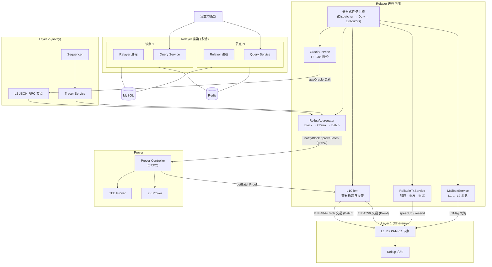
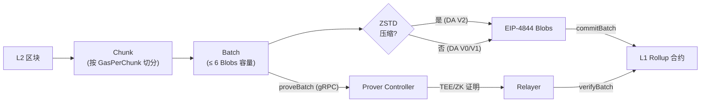
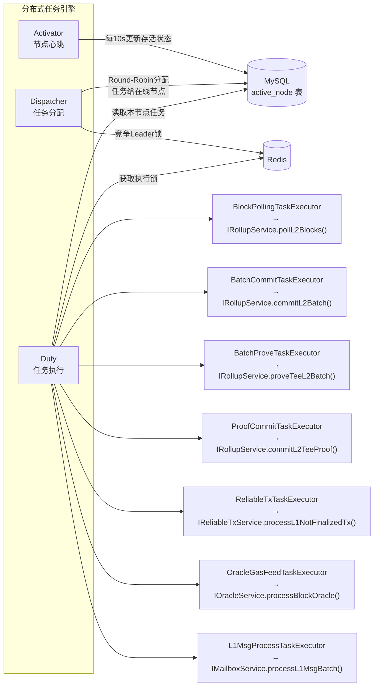

<div align="center">
  

  <h1>Jovay Relayer</h1>

  <p><strong>Jovay L2 Rollup 的核心中间件 — 负责 L1 与 L2 之间的数据聚合、提交和证明管理</strong></p>

  <p>
    <a href="https://www.java.com">
      
    </a>
    <a href="#">
      
    </a>
    <a href="#">
      
    </a>
  </p>

  <p>
    <a href="#系统架构">架构</a> &bull;
    <a href="#功能特性">功能特性</a> &bull;
    <a href="#工程结构">工程结构</a> &bull;
    <a href="#快速开始">快速开始</a> &bull;
    <a href="README.md">English</a>
  </p>
</div>

---

## 系统架构

Relayer 位于 L1（以太坊）和 L2（Jovay）之间，驱动完整的 Rollup 生命周期。它持续拉取 L2 区块，将其聚合为 Chunk 和 Batch，通过 EIP-4844 Blob 交易将 Batch 提交到 L1 Rollup 合约，并协调 Prover Controller 获取 TEE/ZK 证明后通过 EIP-1559 交易提交上链。专用的可靠交易服务确保每笔 L1 交易都能到达终态 — 自动加速、重发或重试。

### 系统总览

Relayer 采用**多节点多活集群**部署（通常 2 节点），通过共享的 MySQL 和 Redis 进行协调。每个节点运行两个独立进程 — **Relayer** 进程（驱动所有 Rollup 任务）和 **Query Service** 进程（提供 REST 查询接口）。负载均衡器将查询流量分发到各 Query Service 实例。



### Rollup 数据管线

核心数据流将原始 L2 区块转化为 L1 上已证明的最终 Batch：



---

## 功能特性

### Rollup 核心

Relayer 通过 Tracer Service 持续从 L2 Jovay 链拉取区块。`RollupAggregator` 根据可配置的 gas 目标值（`GasPerChunk`）将区块组装为 **Chunk**，再将 Chunk 打包为受 EIP-4844 Blob 容量限制（每个 Batch 最多 6 个 Blob）的 **Batch**。当 Batch 封装完成后，Relayer 构造 EIP-4844 Blob 交易并提交到 L1 Rollup 合约，同时通知 Prover Controller 开始生成证明。

### 证明管理

Relayer 同时支持 **TEE**（可信执行环境）和 **ZK**（零知识）证明。提交 Batch 后，Relayer 通过 gRPC 定期轮询 Prover Controller 检查证明是否就绪。一旦获取到证明，通过标准的 EIP-1559 交易提交到 L1 Rollup 合约。Rollup Specs 控制从哪个 Batch Index 开始要求 ZK 验证。

### 可靠交易服务

每笔 L1 交易（Batch 提交或 Proof 提交）都由 `ReliableTxService` 跟踪，通过三种机制确保上链终态：
- **加速**：如果交易超过可配置的超时时间仍未确认，Relayer 以相同 nonce 但更高的 gas tip 重新发送（EIP-1559 提高 10%+，EIP-4844 提高 100%+）。
- **重发**：如果交易从内存池消失（RPC 返回 null 且 finalized nonce 未推进），重新广播原始签名交易。
- **重试**：如果交易收据显示失败（status = 0），Relayer 执行 `eth_call` 预检，条件满足后发送全新交易。

关于交易状态机、Gas 价格计算、加速/重发/重试机制、经济策略及 Nonce 管理的详细说明，请参阅[可靠上链服务参考文档](.doc/reliable-transaction_CN.md)。

### 择时提交（经济策略）

为了优化 L1 Gas 成本，Relayer 实现了**基于 Gas Price 的择时提交策略**。Gas Price 被划分为三个区间 — 绿色、黄色和红色，各自对应不同的提交策略。绿区内交易立即发送；黄区内，待提交数量超阈值**或**等待超时才允许发送；红区内，两个条件**同时**满足才发送。该策略作用于 Batch 提交、Proof 提交和可靠交易的加速/重试流程。

### Batch 数据压缩

Relayer 使用 **ZSTD**（level 3）在将 Batch 数据打入 Blob 之前进行压缩。压缩决策是自动的：如果 ZSTD 能缩小数据体积，则以 DA Version 2 写入压缩数据；否则以 DA Version 1 写入未压缩数据。压缩可将 L1 数据成本降低约 40%。关于 Batch 和 Chunk 数据结构、字段布局、版本差异及 DA 编码格式的详细说明，请参阅 [Batch 数据结构参考文档](.doc/batch-data-structure_CN.md)。

### Rollup Specs — 协议版本管理

Rollup Specs 提供了一套**基于分叉的协议升级机制**，灵感来自以太坊硬分叉。每个"分叉"定义了在特定 Batch Index 生效的 `BatchVersion`，控制 Batch 的序列化、压缩和证明方式。Specs 为主网和测试网预置了配置，私有网络可通过外部 JSON 文件完全自定义。

<p align="center">
  
</p>

### 跨链消息（Mailbox）

Relayer 通过 Mailbox 机制支持 **L1 → L2 消息**（Deposit）和 **L2 → L1 消息**（Withdraw）。对于 Deposit，专用的 `L1MsgProcessTask` 轮询 L1 Mailbox 合约的 `MessageSent` 事件并记录供 L2 处理。对于 Withdraw，Relayer 计算 L2 消息的 Merkle 根并包含在每次 Batch 提交中；Query Service 对外提供接口，用户可获取在 L1 上完成 Withdraw 所需的 Merkle 证明。

### L1 Gas Oracle

`OracleService` 定期读取 L1 的 Gas 价格并提交到 L2 的 `L1GasOracle` 合约，使 L2 能够准确估算用户的 L1 相关成本。

### 多活高可用

Relayer 的分布式任务引擎支持**多节点多活部署**。节点在 MySQL 的 `active_node` 表维护心跳记录。通过 Redis 分布式锁竞选出的 Leader 运行 `Dispatcher`，以 Round-Robin 方式将任务时间片分配给在线节点。每个节点的 `Duty` 组件仅执行分配给自己的任务，Redis 锁防止同一任务在多节点并发执行。

### Jovay Stack — L3 支持

Relayer 可作为 **Jovay Stack** 的组成部分运行 L3 链。当 Parent Chain 是另一个 Jovay 实例（而非以太坊）时，Relayer 从 EIP-4844 Blob 提交切换为 **DA Service** 模式。在此模式下，Relayer 通过 DA Service 存储 Batch 数据，并通过 `commitBatchWithDaProof` 向 Parent Chain 的 Rollup 合约提交 DA 证明。

<p align="center">
  
</p>

### 其他能力

- **阿里云 KMS** 集成，支持安全的私钥托管，无需在配置中暴露明文密钥。
- **以太坊硬分叉适配**（BPO1/BPO2/Fusaka），按分叉时间戳配置 Blob sidecar 版本和 base fee 计算参数。
- **动态配置** — 部分参数（Gas Price 倍率、经济阈值、加速超时等）可通过 [Admin CLI](admin-cli/README_CN.md) 热更新，无需重启服务。
- **优雅退出** — 收到 SIGTERM 信号后，Relayer 完成当前区块处理后再停止，确保数据一致性。

---

## 分布式任务引擎

所有 Relayer 业务由分布式调度引擎驱动，核心包含三个组件：



**Activator** 定时向 MySQL 的 `active_node` 表写入心跳记录。**Dispatcher** 通过 Redis 分布式锁竞选为集群 Leader，查询在线节点后以 Round-Robin 方式分配任务时间片（尽量保持 `BLOCK_POLLING_TASK` 粘性在同一节点）。**Duty** 组件轮询任务表中属于本节点的任务，分发给对应的 `BaseScheduleTaskExecutor` 实现，每个 Executor 底层有独立的线程池。

---

## 工程结构

```
L2-Relayer/
├── relayer-commons/          # 共享模型、枚举、ABI 包装器、Rollup Specs、工具类
├── relayer-dal/              # 数据访问层（MyBatis-Plus 实体 & Mapper）
├── relayer-app/              # Relayer 核心应用
│   ├── config/               #   配置类（RollupConfig, ParentChainConfig, DaServiceConfig）
│   ├── engine/               #   分布式任务调度引擎
│   │   ├── core/             #     Dispatcher, Duty, ScheduleContext
│   │   ├── checker/          #     IDistributedTaskChecker 实现
│   │   └── executor/         #     任务执行器（BlockPolling, BatchCommit 等）
│   ├── service/              #   业务服务（Rollup, ReliableTx, Oracle, Mailbox）
│   ├── core/                 #   领域逻辑
│   │   ├── layer2/           #     RollupAggregator, GrowingBatchChunksMemCache
│   │   ├── blockchain/       #     L1Client, NonceManager, TxManager
│   │   └── prover/           #     ProverControllerClient (gRPC)
│   ├── dal/repository/       #   Repository 接口与实现
│   └── metrics/              #   OpenTelemetry 监控指标
├── query-service/            # REST 查询服务（L2 Msg Proof、Batch 元数据）
├── admin-cli/                # Spring Shell CLI 运行时管理工具（参见 [README](admin-cli/README_CN.md)）
├── jovay-sign-service-spring-boot-starter/  # 交易签名 Starter（Web3j / KMS）
└── docker/                   # Relayer 和 Query Service 的 Dockerfile
```

### 核心类

| 类名 | 所属模块 | 职责 |
|------|---------|------|
| `RollupAggregator` | relayer-app | Block → Chunk → Batch 聚合管线，含压缩和 DA 版本处理 |
| `Dispatcher` | relayer-app | 通过 Redis 锁竞选 Leader，Round-Robin 方式将任务分配给在线节点 |
| `Duty` | relayer-app | 轮询任务表获取本节点任务，分发到 Executor 线程池 |
| `L1Client` | relayer-app | 构造并发送 EIP-4844/1559 交易，查询 Rollup 合约状态 |
| `ReliableTxServiceImpl` | relayer-app | 交易全生命周期管理 — 确认、加速、重发、重试 |
| `ProverControllerClient` | relayer-app | gRPC stub：notifyBlock, notifyChunk, proveBatch, getBatchProof |
| `RollupSpecs` | relayer-commons | 基于分叉的协议版本管理，支持预置和自定义网络 |
| `GrowingBatchChunksMemCache` | relayer-app | 内存中的序列化 Chunk 缓存，避免重复序列化 |
| `RelayerDataController` | query-service | REST 接口：L2 Msg Proof 查询、Batch 元数据范围查询 |

---

## 快速开始

### 前置条件

部署 Relayer 之前，请确保以下基础设施就绪：

- **JDK 21+** — Relayer 基于 Java 21 和 Spring Boot 3.5 构建
- **Maven 3.8+** — 用于从源码构建项目
- **MySQL 8.0+** — 存储 Batch、Chunk、交易和跨链消息数据。Relayer 使用 Flyway 自动管理数据库 Schema 迁移，首次启动时自动建库建表。
- **Redis 6.0+** — 用于分布式锁（多节点任务协调）和缓存（Block Trace、Chunk、Blob 数据）
- **L1 JSON-RPC 节点** — 以太坊（或兼容链）的 RPC 端点。L1 上的 Rollup 和 Mailbox 合约需提前部署。
- **L2 JSON-RPC 节点** — Jovay 链 RPC 端点
- **Tracer Service** — 通过 gRPC 提供 L2 区块 trace 数据
- **Prover Controller** — 通过 gRPC 协调 TEE/ZK 证明生成
- **私钥** — Relayer 需要三组独立的以太坊私钥：L1 Blob Pool 交易（提交 Batch）、L1 Legacy Pool 交易（提交 Proof）和 L2 交易。这三组私钥**必须互不相同**，且不可与其他应用复用。生产环境推荐使用阿里云 KMS 托管私钥。

### 构建

克隆仓库并构建所有模块：

```bash
mvn clean package -DskipTests
```

构建完成后，各模块的 `target/` 目录下会生成可分发的 tar.gz 压缩包。

### 运行

Relayer 支持两种部署方式：**Docker Compose**（生产推荐）或**独立运行**（开发测试）。

#### Docker Compose（推荐）

最简单的方式是通过 Docker Compose 一键部署完整的 Relayer 实例 — 包括 MySQL、Redis、Relayer 和 Query Service。

**方式 A：使用预构建镜像（最快）**

每次发版时，多架构（`amd64`/`arm64`）Docker 镜像会自动发布到 GitHub Container Registry：

| 镜像 | 拉取命令 |
|------|---------|
| Relayer | `docker pull ghcr.io/jovaynetwork/jovay-relayer:<版本号>` |
| Query Service | `docker pull ghcr.io/jovaynetwork/jovay-relayer-query-service:<版本号>` |

使用 `docker/compose-open.yaml` 启动完整服务栈：

```bash
cd docker

# 创建 .env 文件配置参数
cat > .env << 'EOF'
DOCKER_TAG=0.12.0
MYSQL_ROOT_PASSWORD=your_mysql_password
REDIS_PASSWORD=your_redis_password
L1_RPC_URL=https://your-l1-rpc-endpoint
L1_ROLLUP_CONTRACT=0x...
L1_MAILBOX_CONTRACT=0x...
L2_RPC_URL=https://your-l2-rpc-endpoint
TRACER_IP=your-tracer-ip
TRACER_PORT=your-tracer-port
PROVER_CONTROLLER_ENDPOINTS=your-prover-ip:port
ROLLUP_SPECS_NETWORK=mainnet
L1_LEGACY_POOL_TX_SIGN_SERVICE_TYPE=WEB3J_NATIVE
L1_CLIENT_LEGACY_POOL_TX_PRIVATE_KEY=0x...
L1_BLOB_POOL_TX_SIGN_SERVICE_TYPE=WEB3J_NATIVE
L1_CLIENT_BLOB_POOL_TX_PRIVATE_KEY=0x...
L2_TX_SIGN_SERVICE_TYPE=WEB3J_NATIVE
L2_CLIENT_PRIVATE_KEY=0x...
EOF

# 启动全部服务
docker compose -f compose-open.yaml up -d
```

**方式 B：从源码构建镜像**

```bash
# 编译项目
mvn clean package -DskipTests

# 拷贝构建产物到 docker 目录
cp relayer-app/target/l2-relayer-*.tar.gz docker/l2-relayer.tar.gz
cp query-service/target/query-service-*.tar.gz docker/query-service.tar.gz

# 构建 Docker 镜像
cd docker
docker build -f Dockerfile-Relayer-Open -t ghcr.io/jovaynetwork/jovay-relayer:local .
docker build -f Dockerfile-QS-Open -t ghcr.io/jovaynetwork/jovay-relayer-query-service:local .

# 使用本地构建的镜像启动
DOCKER_TAG=local docker compose -f compose-open.yaml up -d
```

启动前需要配置链连接地址、合约地址、私钥等环境变量。详见 **[配置操作文档](.doc/configuration-guide_CN.md)**，其中包含全部必填和可选环境变量及最佳实践。

#### 独立运行

开发或测试时，可以直接运行各组件：

**Relayer：**
```bash
cd relayer-app/target
tar -xzf l2-relayer.tar.gz
cd l2-relayer
./bin/start.sh
```

**Query Service：**
```bash
cd query-service/target
tar -xzf query-service.tar.gz
cd query-service
./bin/start.sh
```

独立运行时，通过设置环境变量或编辑 `application-prod.yml` 进行配置。详见 **[配置操作文档](.doc/configuration-guide_CN.md)**。

### Admin CLI

[Admin CLI](admin-cli/README_CN.md) 是基于 Spring Shell 的命令行运维工具，支持运行时查询 Relayer 状态、手动提交 Batch/Proof、调整 Gas Price 参数、管理交易 Nonce 等操作。可在运行中的 Relayer 容器内启动，也可作为独立 JAR 运行。

```bash
# 容器内启动
docker exec -it l2-relayer-0 /l2-relayer/bin/relayer-cli/bin/start.sh

# 独立运行
cd admin-cli/target
tar -xzf admin-cli.tar.gz
cd admin-cli
./bin/start.sh
```

完整命令参考请查阅 [Admin CLI 使用指南](admin-cli/README_CN.md)。

---

## 许可证

[Apache License 2.0](LICENSE)
